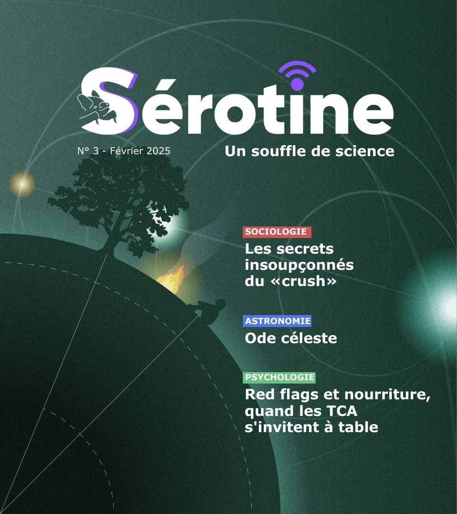
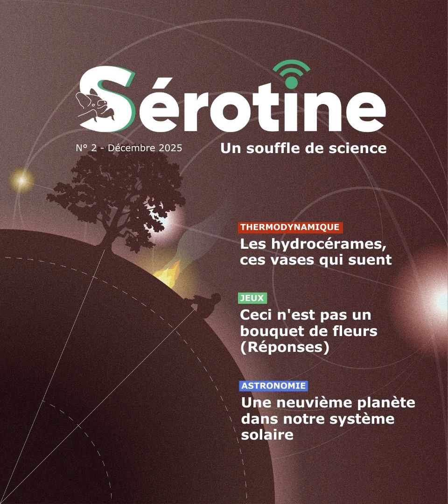

  
  by
  

Bienvenue sur la page du webzine **Serotine, un souffle de science**, portée par l'association [AurorAlpes](https://www.auroralpes.fr/).
Retrouver ci-dessous, les différents numéros du webzine !

_Afin de poster un commentaire, il est nécessaire de créer un compte sur GitHub (il est possible de le faire à partir d'un compte Google)._

## Saison 1

### #4 Mars 2026
- Rendez-vous mi-mars

### #3 Février 2026

<!-- Flexbox (fonctionne dans la plupart des renderers Markdown qui acceptent du HTML inline) -->

  <!-- Colonne image (fixe / adaptative) -->
  

    
  

  <!-- Colonne texte (liste) -->
  

    <ul style="margin:0; padding-left:1.2em;">
      <li><a href="https://heyzine.com/flip-book/d5c17bee9a.html#page/4" target="_blank">Les secrets insoupçonnés du «crush»</a><a href="articles/crush.html" target="_blank">   [Commentaire]</a></li>
      <li><a href="https://heyzine.com/flip-book/d5c17bee9a.html#page/12" target="_blank">Ode céleste</a><a href="articles/ode_celeste.html" target="_blank">   [Commentaire]</a></li>
      <li><a href="https://heyzine.com/flip-book/d5c17bee9a.html#page/15" target="_blank">Red flags et nourriture, quand les TCA s'invitent à table</a><a href="articles/tca.html" target="_blank">   [Commentaire]</a></li>
    </ul>
  

### #2 Décembre 2025

<!-- Flexbox (fonctionne dans la plupart des renderers Markdown qui acceptent du HTML inline) -->

  <!-- Colonne image (fixe / adaptative) -->
  

    
  

  <!-- Colonne texte (liste) -->
  

    <ul style="margin:0; padding-left:1.2em;">
      <li><a href="https://heyzine.com/flip-book/5f6791f646.html#page/4" target="_blank">Les hydrocérames, ces vases qui suent</a><a href="articles/hydrocerame.html" target="_blank">   [Commentaire]</a></li>
      <li><a href="https://heyzine.com/flip-book/5f6791f646.html#page/16" target="_blank">Ceci n'est pas un bouquet de fleurs (Sudoku)</a><a href="articles/aphantasie_sudoku_2.html" target="_blank">   [Commentaire]</a></li>
      <li><a href="https://heyzine.com/flip-book/5f6791f646.html#page/18" target="_blank">Une neuvième planète dans notre système solaire</a><a href="articles/planete_neuf.html" target="_blank">   [Commentaire]</a></li>
    </ul>
  

### #1 Novembre 2025

<!-- Flexbox (fonctionne dans la plupart des renderers Markdown qui acceptent du HTML inline) -->

  <!-- Colonne image (fixe / adaptative) -->
  

    
  

  <!-- Colonne texte (liste) -->
  

    <ul style="margin:0; padding-left:1.2em;">
      <li><a href="https://heyzine.com/flip-book/78d38fd9ec.html#page/4" target="_blank">L'aphantasie</a> <a href="articles/aphantasie.html" target="_blank">   [Commentaire]</a></li>
      <li><a href="https://heyzine.com/flip-book/78d38fd9ec.html#page/16" target="_blank">Ceci n'est pas un bouquet de fleurs (Sudoku)</a><a href="articles/aphantasie_sudoku.html" target="_blank">   [Commentaire]</a></li>
      <li><a href="https://heyzine.com/flip-book/78d38fd9ec.html#page/18" target="_blank">Peut-on respirer par l'anus ?</a><a href="articles/respirer_par_anus.html" target="_blank">   [Commentaire]</a></li>
    </ul>
  

---

## Crédits
Ce site est développé à partir du projet [utterances](https://github.com/utterance/utterances) développé par [jdanyow](https://github.com/jdanyow)

